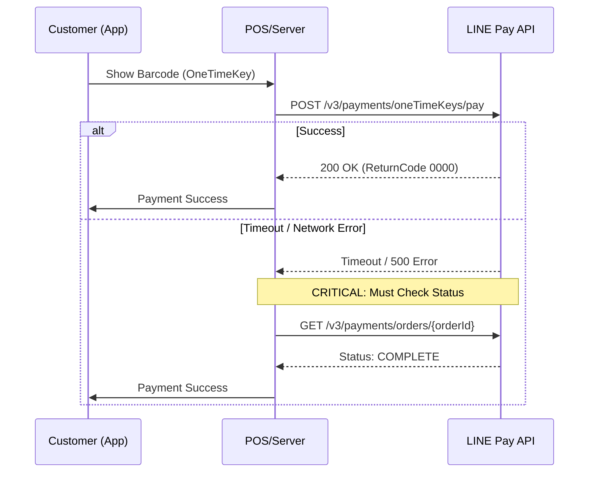

# LINE Pay Offline V4 PHP SDK

[](https://github.com/CarlLee1983/line-pay-offline-v4-php/actions/workflows/ci.yml)
[](https://packagist.org/packages/carllee/line-pay-offline-v4)
[](LICENSE)

Modern, type-safe LINE Pay Offline V4 API SDK for PHP.

**🌐 Language / 語言 / 言語 / ภาษา:**
[English](./README.md) | [繁體中文](./README_ZH.md) | [日本語](./README_JA.md) | [ภาษาไทย](./README_TH.md)

## Features

- ✅ **PHP 8.1+** with strict types and enums
- ✅ **Laravel Integration** - ServiceProvider, Facade, IoC support
- ✅ **POS/Kiosk Terminal Support** - For retail and food service
- ✅ **One-Time Key Payment** - Scan customer's barcode
- ✅ **Full API Coverage** - Payment, capture, void, refund
- ✅ **Type-Safe Enums** - Currency, PaymentStatus, etc.
- ✅ **PHPStan Level Max** - Strict static analysis
- ✅ **Built on Core SDK** - Shares code with Online SDK

## Requirements

- PHP 8.1 or higher
- Composer
- ext-json
- ext-openssl

## Installation

```bash
composer require carllee/line-pay-offline-v4
```

## Payment Flow



## Quick Start

> "✨ **Developer Experience:** This SDK uses DTOs and Enums. Your IDE will provide full autocompletion for request parameters and response fields, eliminating 'magic string' typos."

```php
<?php

use LinePay\Offline\Config\LinePayOfflineConfig;
use LinePay\Offline\LinePayOfflineClient;
use LinePay\Offline\Enums\Currency;

// Create configuration
$config = new LinePayOfflineConfig(
    channelId: getenv('LINE_PAY_CHANNEL_ID'),
    channelSecret: getenv('LINE_PAY_CHANNEL_SECRET'),
    merchantDeviceProfileId: 'POS-001',  // Your POS terminal ID
    merchantDeviceType: 'POS',           // Device type
    env: 'sandbox'                        // or 'production'
);

// Create client
$client = new LinePayOfflineClient($config);

// Request payment with customer's barcode (oneTimeKey)
$response = $client->requestPayment([
    'amount' => 100,
    'currency' => 'TWD',
    'oneTimeKey' => '12345678901245678', // From customer's LINE Pay barcode
    'orderId' => 'ORDER-' . time(),
    'packages' => [
        [
            'id' => 'PKG-001',
            'amount' => 100,
            'products' => [
                ['name' => 'Coffee', 'quantity' => 1, 'price' => 100]
            ]
        ]
    ]
]);

if ($response['returnCode'] === '0000') {
    echo "Payment successful!\n";
    echo "Transaction ID: " . $response['info']['transactionId'] . "\n";
}
```

## Laravel Integration

The package supports **Laravel Package Discovery**. Just install it via composer, and the ServiceProvider and Facade will be registered automatically.

### Configuration

Publish the config file:

```bash
php artisan vendor:publish --tag=linepay-offline-config
```

Add to your `.env`:

```env
LINE_PAY_CHANNEL_ID=your-channel-id
LINE_PAY_CHANNEL_SECRET=your-channel-secret
LINE_PAY_MERCHANT_DEVICE_ID=POS-001
LINE_PAY_MERCHANT_DEVICE_TYPE=POS
LINE_PAY_ENV=sandbox
LINE_PAY_TIMEOUT=40
```

### Using Dependency Injection

```php
namespace App\Http\Controllers;

use LinePay\Offline\LinePayOfflineClient;
use LinePay\Offline\Enums\Currency;

class POSController extends Controller
{
    public function __construct(
        private LinePayOfflineClient $linePay
    ) {}

    public function processPayment(string $oneTimeKey)
    {
        $response = $this->linePay->requestPayment([
            'amount' => 100,
            'currency' => 'TWD',
            'oneTimeKey' => $oneTimeKey,
            'orderId' => 'ORDER-' . time(),
            'packages' => [
                ['id' => 'PKG-001', 'amount' => 100, 'products' => [
                    ['name' => 'Coffee', 'quantity' => 1, 'price' => 100]
                ]]
            ]
        ]);

        return response()->json($response);
    }
}
```

### Using Facade

```php
use LinePay\Offline\Laravel\LinePayOffline;

// Request payment
$response = LinePayOffline::requestPayment($request);

// Check status
$status = LinePayOffline::checkPaymentStatus($orderId);

// Refund
$response = LinePayOffline::refundPayment($orderId, 50);
```

## API Methods

### Request Payment

Request payment using customer's one-time barcode:

```php
$response = $client->requestPayment([
    'amount' => 100,
    'currency' => 'TWD',
    'oneTimeKey' => '12345678901245678',
    'orderId' => 'ORDER-001',
    'options' => [
        'payment' => [
            'capture' => true  // Capture immediately (default)
        ],
        'extra' => [
            'branchId' => 'BRANCH-001',
            'branchName' => 'Main Store'
        ]
    ]
]);
```

### Check Payment Status

Check payment status (use after timeout):

```php
$status = $client->checkPaymentStatus('ORDER-001');
// Returns: COMPLETE, FAIL, or REFUND
echo "Status: " . $status['info']['status'];
```

### Capture Payment

Capture an authorized payment:

```php
$response = $client->capturePayment(
    orderId: 'ORDER-001',
    amount: 100,
    currency: Currency::TWD
);
```

### Void Authorization

Cancel an authorization before capture:

```php
$response = $client->voidAuthorization('ORDER-001');
```

### Refund Payment

Refund a completed payment:

```php
// Full refund
$response = $client->refundPayment('ORDER-001');

// Partial refund
$response = $client->refundPayment('ORDER-001', 50);
```

### Query Authorizations

Query authorization information:

```php
$auths = $client->queryAuthorizations(orderId: 'ORDER-001');
// or
$auths = $client->queryAuthorizations(transactionId: '1234567890123456789');
```

### Retrieve Payment Details

Get detailed payment information:

```php
$details = $client->retrievePaymentDetails(orderId: 'ORDER-001');
```

## Error Handling

```php
use LinePay\Core\Errors\LinePayError;
use LinePay\Core\Errors\LinePayTimeoutError;
use LinePay\Core\Errors\LinePayConfigError;

try {
    $response = $client->requestPayment($request);
    
} catch (LinePayTimeoutError $e) {
    // Timeout occurred - ALWAYS check payment status
    $status = $client->checkPaymentStatus($orderId);
    
    if ($status['info']['status'] === 'COMPLETE') {
        // Payment was successful despite timeout
        handleSuccessfulPayment($status);
    } else {
        // Payment failed or still processing
        handleFailedPayment($status);
    }
    
} catch (LinePayError $e) {
    // API error
    echo "Error Code: " . $e->getReturnCode() . "\n";
    echo "Error Message: " . $e->getReturnMessage() . "\n";
    
} catch (LinePayConfigError $e) {
    // Configuration error
    echo "Config Error: " . $e->getMessage() . "\n";
}
```

## Common Pitfalls & Troubleshooting

### ⚠️ Critical: Handling Timeouts (Read Timeout)

LINE Pay Offline API interactions involve real-world network latency (connecting to POS, waiting for user confirmation).

**The Problem:**
You might receive a `ConnectTimeout` or `ReadTimeout` (cURL error 28) if the response takes longer than your configured timeout settings.

**The Solution:**
**NEVER** assume the payment failed just because of a timeout. The transaction might have succeeded on LINE Pay's server while your server gave up waiting.

1.  **Catch the Error:** Always catch `LinePayTimeoutError`.
2.  **Double Check:** Immediately call `checkPaymentStatus($orderId)`.
3.  **Reconcile:** If `checkPaymentStatus` returns `COMPLETE`, treat the order as paid.

<!-- end list -->

```php
try {
    $response = $client->requestPayment(...);
} catch (LinePayTimeoutError $e) {
    // 1. Log the timeout
    // 2. Check actual status from LINE Pay
    $status = $client->checkPaymentStatus($orderId);
    
    if ($status['info']['status'] === 'COMPLETE') {
        // Handle as success
    }
}
```

### 🚫 OneTimeKey Reuse (Error 1172)

The `oneTimeKey` (barcode) provided by the customer is **single-use only** and expires quickly (usually 5 minutes).

  * **Do not** try to reuse a barcode for a retry if the first request failed with a logic error.
  * **Do not** use a hardcoded barcode for testing; you must regenerate it from the LINE App each time.

### 💰 Amount Mismatch (Error 1106)

When calling `capturePayment()`, the `amount` must match the authorized amount (unless you are performing a partial capture, if allowed).

  * Ensure your database stores the exact authorized amount.
  * Floating point precision errors can occur; consider storing amounts as integers (e.g., cents) or using `bcmath`.

## Configuration Options

| Option | Type | Required | Description |
|--------|------|----------|-------------|
| `channelId` | string | ✅ | LINE Pay Channel ID |
| `channelSecret` | string | ✅ | LINE Pay Channel Secret |
| `merchantDeviceProfileId` | string | ✅ | Your POS/terminal device ID |
| `merchantDeviceType` | string | ❌ | Device type (default: "POS") |
| `env` | string | ❌ | Environment: "sandbox" or "production" |
| `timeout` | int | ❌ | Request timeout in seconds (default: 20) |

## Best Practices

### 1. Handle Timeouts Properly

As detailed in the **[Common Pitfalls & Troubleshooting](#common-pitfalls--troubleshooting)** section, **never** treat a timeout as a failure. Always verify the transaction status using `checkPaymentStatus()`.

### 2. Verify Payment Amounts

Always verify the payment amount in the response:

```php
$response = $client->requestPayment($request);
$totalPaid = array_sum(array_column($response['info']['payInfo'], 'amount'));

if ($totalPaid !== $requestedAmount) {
    error_log("Amount mismatch: requested $requestedAmount, paid $totalPaid");
}
```

### 3. Use Environment Variables

Never hardcode credentials:

```php
$config = new LinePayOfflineConfig(
    channelId: getenv('LINE_PAY_CHANNEL_ID'),
    channelSecret: getenv('LINE_PAY_CHANNEL_SECRET'),
    merchantDeviceProfileId: getenv('MERCHANT_DEVICE_ID')
);
```

## Testing

```bash
# Run tests
composer test

# Run static analysis
composer analyze

# Check code style
composer lint
```

## Related Packages

  - [line-pay-core-v4](https://github.com/CarlLee1983/line-pay-core-v4-php) - Core SDK (dependency)
  - [line-pay-online-v4](https://github.com/CarlLee1983/line-pay-online-v4-php) - Online Payment SDK

## License

MIT License - see [LICENSE](LICENSE) for details.

## Resources

  - [LINE Pay Offline API Documentation](https://pay.line.me/documents/offline.html)
  - [LINE Pay Merchant Center](https://pay.line.me/portal/tw/)
  - [Report Issues](https://github.com/CarlLee1983/line-pay-offline-v4-php/issues)
