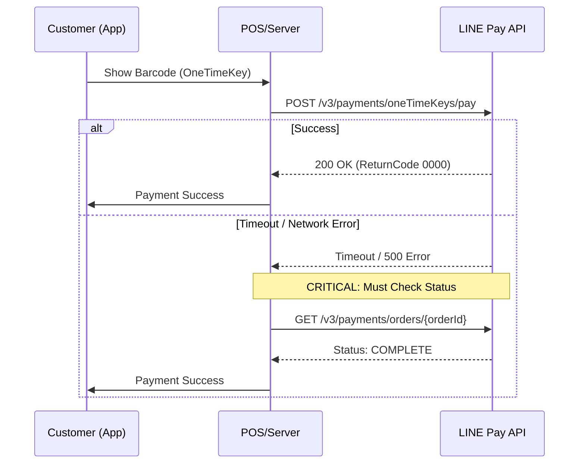

# LINE Pay Offline V4 PHP SDK

[](https://github.com/CarlLee1983/line-pay-offline-v4-php/actions/workflows/ci.yml)
[](https://packagist.org/packages/carllee/line-pay-offline-v4)
[](LICENSE)

モダンでタイプセーフな LINE Pay Offline V4 API PHP SDK。

**🌐 Language / 語言 / 言語 / ภาษา:**
[English](./README.md) | [繁體中文](./README_ZH.md) | [日本語](./README_JA.md) | [ภาษาไทย](./README_TH.md)

## 機能

- ✅ **PHP 8.1+** 厳格な型とEnum対応
- ✅ **Laravel統合** - ServiceProvider、Facade、IoC対応
- ✅ **POS/Kiosk端末サポート** - 小売・飲食サービス向け
- ✅ **ワンタイムキー決済** - お客様のバーコードをスキャン
- ✅ **完全なAPIカバレッジ** - 決済、キャプチャ、取消、返金
- ✅ **タイプセーフなEnum** - Currency、PaymentStatus など
- ✅ **PHPStan Level Max** - 厳格な静的解析
- ✅ **コアSDKベース** - Online SDKとコード共有

## 要件

- PHP 8.1以上
- Composer
- ext-json
- ext-openssl

## インストール

```bash
composer require carllee/line-pay-offline-v4
```

## 支払いフロー



## クイックスタート

> ✨ **開発者体験:** このSDKはDTOとEnumを使用しています。IDEはリクエストパラメータとレスポンスフィールドの完全なオートコンプリートを提供し、「マジック文字列」のタイプミスを排除します。

```php
<?php

use LinePay\Offline\Config\LinePayOfflineConfig;
use LinePay\Offline\LinePayOfflineClient;
use LinePay\Offline\Enums\Currency;

// 設定を作成
$config = new LinePayOfflineConfig(
    channelId: getenv('LINE_PAY_CHANNEL_ID'),
    channelSecret: getenv('LINE_PAY_CHANNEL_SECRET'),
    merchantDeviceProfileId: 'POS-001',  // POS端末ID
    merchantDeviceType: 'POS',           // デバイスタイプ
    env: 'sandbox'                        // または 'production'
);

// クライアントを作成
$client = new LinePayOfflineClient($config);

// お客様のバーコード（oneTimeKey）で決済をリクエスト
$response = $client->requestPayment([
    'amount' => 100,
    'currency' => 'JPY',
    'oneTimeKey' => '12345678901245678', // お客様のLINE Payバーコードから
    'orderId' => 'ORDER-' . time(),
    'packages' => [
        [
            'id' => 'PKG-001',
            'amount' => 100,
            'products' => [
                ['name' => 'コーヒー', 'quantity' => 1, 'price' => 100]
            ]
        ]
    ]
]);

if ($response['returnCode'] === '0000') {
    echo "決済成功！\n";
    echo "取引ID: " . $response['info']['transactionId'] . "\n";
}
```

## Laravel統合

このパッケージは **Laravel Package Discovery** をサポートしています。composerでインストールするだけで、ServiceProviderとFacadeが自動的に登録されます。

### 設定

設定ファイルを公開：

```bash
php artisan vendor:publish --tag=linepay-offline-config
```

`.env` に追加：

```env
LINE_PAY_CHANNEL_ID=your-channel-id
LINE_PAY_CHANNEL_SECRET=your-channel-secret
LINE_PAY_MERCHANT_DEVICE_ID=POS-001
LINE_PAY_MERCHANT_DEVICE_TYPE=POS
LINE_PAY_ENV=sandbox
LINE_PAY_TIMEOUT=40
```

### 依存性注入を使用

```php
namespace App\Http\Controllers;

use LinePay\Offline\LinePayOfflineClient;
use LinePay\Offline\Enums\Currency;

class POSController extends Controller
{
    public function __construct(
        private LinePayOfflineClient $linePay
    ) {}

    public function processPayment(string $oneTimeKey)
    {
        $response = $this->linePay->requestPayment([
            'amount' => 100,
            'currency' => 'JPY',
            'oneTimeKey' => $oneTimeKey,
            'orderId' => 'ORDER-' . time(),
            'packages' => [
                ['id' => 'PKG-001', 'amount' => 100, 'products' => [
                    ['name' => 'コーヒー', 'quantity' => 1, 'price' => 100]
                ]]
            ]
        ]);

        return response()->json($response);
    }
}
```

### Facadeを使用

```php
use LinePay\Offline\Laravel\LinePayOffline;

// 決済リクエスト
$response = LinePayOffline::requestPayment($request);

// ステータス確認
$status = LinePayOffline::checkPaymentStatus($orderId);

// 返金
$response = LinePayOffline::refundPayment($orderId, 50);
```

## APIメソッド

### 決済リクエスト

お客様のワンタイムバーコードで決済をリクエスト：

```php
$response = $client->requestPayment([
    'amount' => 100,
    'currency' => 'JPY',
    'oneTimeKey' => '12345678901245678',
    'orderId' => 'ORDER-001',
    'options' => [
        'payment' => [
            'capture' => true  // 即時キャプチャ（デフォルト）
        ],
        'extra' => [
            'branchId' => 'BRANCH-001',
            'branchName' => '本店'
        ]
    ]
]);
```

### 決済ステータス確認

決済ステータスを確認（タイムアウト後に使用）：

```php
$status = $client->checkPaymentStatus('ORDER-001');
// 戻り値: COMPLETE, FAIL, または REFUND
echo "ステータス: " . $status['info']['status'];
```

### キャプチャ

承認済み決済をキャプチャ：

```php
$response = $client->capturePayment(
    orderId: 'ORDER-001',
    amount: 100,
    currency: Currency::JPY
);
```

### 承認取消

キャプチャ前に承認を取消：

```php
$response = $client->voidAuthorization('ORDER-001');
```

### 返金

完了した決済を返金：

```php
// 全額返金
$response = $client->refundPayment('ORDER-001');

// 一部返金
$response = $client->refundPayment('ORDER-001', 50);
```

### 承認照会

承認情報を照会：

```php
$auths = $client->queryAuthorizations(orderId: 'ORDER-001');
// または
$auths = $client->queryAuthorizations(transactionId: '1234567890123456789');
```

### 決済詳細取得

詳細な決済情報を取得：

```php
$details = $client->retrievePaymentDetails(orderId: 'ORDER-001');
```

## エラーハンドリング

```php
use LinePay\Core\Errors\LinePayError;
use LinePay\Core\Errors\LinePayTimeoutError;
use LinePay\Core\Errors\LinePayConfigError;

try {
    $response = $client->requestPayment($request);
    
} catch (LinePayTimeoutError $e) {
    // タイムアウト発生 - 必ず決済ステータスを確認
    $status = $client->checkPaymentStatus($orderId);
    
    if ($status['info']['status'] === 'COMPLETE') {
        // タイムアウトしても決済は成功
        handleSuccessfulPayment($status);
    } else {
        // 決済失敗または処理中
        handleFailedPayment($status);
    }
    
} catch (LinePayError $e) {
    // APIエラー
    echo "エラーコード: " . $e->getReturnCode() . "\n";
    echo "エラーメッセージ: " . $e->getReturnMessage() . "\n";
    
} catch (LinePayConfigError $e) {
    // 設定エラー
    echo "設定エラー: " . $e->getMessage() . "\n";
}
```

## よくある問題とトラブルシューティング

### ⚠️ 重要：タイムアウトの処理（Read Timeout）

LINE Pay Offline APIは実際のネットワーク遅延（POSへの接続、ユーザー確認の待機）が発生します。

**問題：**
設定したタイムアウト時間を超えると、`ConnectTimeout` または `ReadTimeout`（cURL error 28）が発生する場合があります。

**解決策：**
タイムアウトだけで決済失敗と判断しないでください。トランザクションはLINE Payサーバーで成功している可能性があります。

1. **エラーをキャッチ：** 必ず `LinePayTimeoutError` をキャッチ。
2. **再確認：** すぐに `checkPaymentStatus($orderId)` を呼び出す。
3. **照合：** `checkPaymentStatus` が `COMPLETE` を返したら注文を支払い済みとして処理。

```php
try {
    $response = $client->requestPayment(...);
} catch (LinePayTimeoutError $e) {
    // 1. タイムアウトをログ
    // 2. LINE Payから実際のステータスを確認
    $status = $client->checkPaymentStatus($orderId);
    
    if ($status['info']['status'] === 'COMPLETE') {
        // 成功として処理
    }
}
```

### 🚫 OneTimeKeyの再利用（Error 1172）

お客様が提供する `oneTimeKey`（バーコード）は**一回限り**で、すぐに期限切れになります（通常5分）。

* ロジックエラーで最初のリクエストが失敗した場合、バーコードを再利用しない。
* テスト用にハードコードされたバーコードを使用しない。LINEアプリから毎回再生成する。

### 💰 金額不一致（Error 1106）

`capturePayment()` を呼び出すとき、`amount` は承認金額と一致する必要があります。

* データベースに正確な承認金額を保存。
* 浮動小数点の精度エラーに注意。整数（円単位）で保存するか `bcmath` を使用。

## 設定オプション

| オプション | 型 | 必須 | 説明 |
|------------|------|------|------|
| `channelId` | string | ✅ | LINE Pay Channel ID |
| `channelSecret` | string | ✅ | LINE Pay Channel Secret |
| `merchantDeviceProfileId` | string | ✅ | POS/端末デバイスID |
| `merchantDeviceType` | string | ❌ | デバイスタイプ（デフォルト："POS"）|
| `env` | string | ❌ | 環境："sandbox" または "production" |
| `timeout` | int | ❌ | リクエストタイムアウト秒数（デフォルト：20）|

## ベストプラクティス

### 1. タイムアウトを適切に処理

**[よくある問題とトラブルシューティング](#よくある問題とトラブルシューティング)** セクションで詳述の通り、タイムアウトを失敗とみなさないでください。必ず `checkPaymentStatus()` でトランザクションステータスを確認してください。

### 2. 決済金額を検証

レスポンスの決済金額を必ず検証：

```php
$response = $client->requestPayment($request);
$totalPaid = array_sum(array_column($response['info']['payInfo'], 'amount'));

if ($totalPaid !== $requestedAmount) {
    error_log("金額不一致: リクエスト $requestedAmount, 実際 $totalPaid");
}
```

### 3. 環境変数を使用

認証情報をハードコードしない：

```php
$config = new LinePayOfflineConfig(
    channelId: getenv('LINE_PAY_CHANNEL_ID'),
    channelSecret: getenv('LINE_PAY_CHANNEL_SECRET'),
    merchantDeviceProfileId: getenv('MERCHANT_DEVICE_ID')
);
```

## テスト

```bash
# テストを実行
composer test

# 静的解析を実行
composer analyze

# コードスタイルをチェック
composer lint
```

## 関連パッケージ

- [line-pay-core-v4](https://github.com/CarlLee1983/line-pay-core-v4-php) - コアSDK（依存）
- [line-pay-online-v4](https://github.com/CarlLee1983/line-pay-online-v4-php) - オンライン決済SDK

## ライセンス

MITライセンス - 詳細は [LICENSE](LICENSE) を参照。

## リソース

- [LINE Pay Offline APIドキュメント](https://pay.line.me/documents/offline.html)
- [LINE Pay加盟店センター](https://pay.line.me/portal/jp/)
- [問題を報告](https://github.com/CarlLee1983/line-pay-offline-v4-php/issues)
