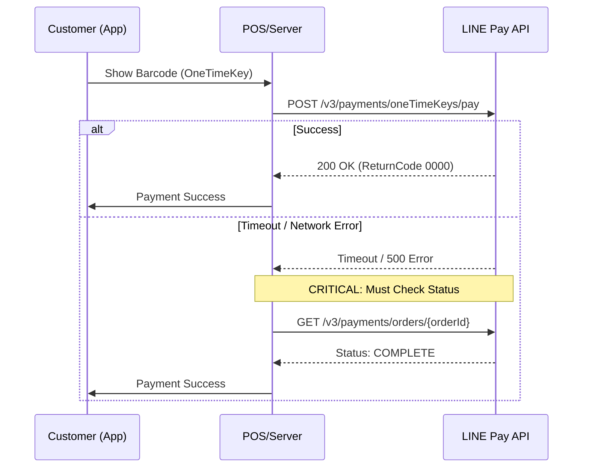

# LINE Pay Offline V4 PHP SDK

[](https://github.com/CarlLee1983/line-pay-offline-v4-php/actions/workflows/ci.yml)
[](https://packagist.org/packages/carllee/line-pay-offline-v4)
[](LICENSE)

LINE Pay Offline V4 API SDK สำหรับ PHP ที่ทันสมัยและปลอดภัยด้านประเภทข้อมูล

**🌐 Language / 語言 / 言語 / ภาษา:**
[English](./README.md) | [繁體中文](./README_ZH.md) | [日本語](./README_JA.md) | [ภาษาไทย](./README_TH.md)

## คุณสมบัติ

- ✅ **PHP 8.1+** พร้อม strict types และ enums
- ✅ **Laravel Integration** - ServiceProvider, Facade, IoC support
- ✅ **รองรับเครื่อง POS/Kiosk** - สำหรับร้านค้าปลีกและบริการอาหาร
- ✅ **ชำระเงินด้วย One-Time Key** - สแกนบาร์โค้ดของลูกค้า
- ✅ **ครอบคลุม API ทั้งหมด** - ชำระเงิน, capture, void, refund
- ✅ **Type-Safe Enums** - Currency, PaymentStatus ฯลฯ
- ✅ **PHPStan Level Max** - การวิเคราะห์แบบ static ที่เข้มงวด
- ✅ **สร้างบน Core SDK** - ใช้โค้ดร่วมกับ Online SDK

## ความต้องการ

- PHP 8.1 หรือสูงกว่า
- Composer
- ext-json
- ext-openssl

## การติดตั้ง

```bash
composer require carllee/line-pay-offline-v4
```

## วิธีการชำระเงิน

> ✨ **ประสบการณ์นักพัฒนา:** SDK นี้ใช้ DTOs และ Enums. IDE ของคุณจะมีการเติมข้อความอัตโนมัติสำหรับพารามิเตอร์คำขอและฟิลด์การตอบกลับ ช่วยลดข้อผิดพลาดจาก 'magic string' ได้



## เริ่มต้นใช้งาน

```php
<?php

use LinePay\Offline\Config\LinePayOfflineConfig;
use LinePay\Offline\LinePayOfflineClient;
use LinePay\Offline\Enums\Currency;

// สร้างการตั้งค่า
$config = new LinePayOfflineConfig(
    channelId: getenv('LINE_PAY_CHANNEL_ID'),
    channelSecret: getenv('LINE_PAY_CHANNEL_SECRET'),
    merchantDeviceProfileId: 'POS-001',  // ID เครื่อง POS ของคุณ
    merchantDeviceType: 'POS',           // ประเภทอุปกรณ์
    env: 'sandbox'                        // หรือ 'production'
);

// สร้าง client
$client = new LinePayOfflineClient($config);

// ขอชำระเงินด้วยบาร์โค้ดของลูกค้า (oneTimeKey)
$response = $client->requestPayment([
    'amount' => 100,
    'currency' => 'THB',
    'oneTimeKey' => '12345678901245678', // จากบาร์โค้ด LINE Pay ของลูกค้า
    'orderId' => 'ORDER-' . time(),
    'packages' => [
        [
            'id' => 'PKG-001',
            'amount' => 100,
            'products' => [
                ['name' => 'กาแฟ', 'quantity' => 1, 'price' => 100]
            ]
        ]
    ]
]);

if ($response['returnCode'] === '0000') {
    echo "ชำระเงินสำเร็จ!\n";
    echo "Transaction ID: " . $response['info']['transactionId'] . "\n";
}
```

## การใช้งานกับ Laravel

แพ็คเกจนี้รองรับ **Laravel Package Discovery** เพียงติดตั้งผ่าน composer แล้ว ServiceProvider และ Facade จะลงทะเบียนโดยอัตโนมัติ

### การตั้งค่า

เผยแพร่ไฟล์ config:

```bash
php artisan vendor:publish --tag=linepay-offline-config
```

เพิ่มใน `.env`:

```env
LINE_PAY_CHANNEL_ID=your-channel-id
LINE_PAY_CHANNEL_SECRET=your-channel-secret
LINE_PAY_MERCHANT_DEVICE_ID=POS-001
LINE_PAY_MERCHANT_DEVICE_TYPE=POS
LINE_PAY_ENV=sandbox
LINE_PAY_TIMEOUT=40
```

### การใช้ Dependency Injection

```php
namespace App\Http\Controllers;

use LinePay\Offline\LinePayOfflineClient;
use LinePay\Offline\Enums\Currency;

class POSController extends Controller
{
    public function __construct(
        private LinePayOfflineClient $linePay
    ) {}

    public function processPayment(string $oneTimeKey)
    {
        $response = $this->linePay->requestPayment([
            'amount' => 100,
            'currency' => 'THB',
            'oneTimeKey' => $oneTimeKey,
            'orderId' => 'ORDER-' . time(),
            'packages' => [
                ['id' => 'PKG-001', 'amount' => 100, 'products' => [
                    ['name' => 'กาแฟ', 'quantity' => 1, 'price' => 100]
                ]]
            ]
        ]);

        return response()->json($response);
    }
}
```

### การใช้ Facade

```php
use LinePay\Offline\Laravel\LinePayOffline;

// ขอชำระเงิน
$response = LinePayOffline::requestPayment($request);

// ตรวจสอบสถานะ
$status = LinePayOffline::checkPaymentStatus($orderId);

// คืนเงิน
$response = LinePayOffline::refundPayment($orderId, 50);
```

## API Methods

### ขอชำระเงิน

ขอชำระเงินด้วยบาร์โค้ดแบบใช้ครั้งเดียวของลูกค้า:

```php
$response = $client->requestPayment([
    'amount' => 100,
    'currency' => 'THB',
    'oneTimeKey' => '12345678901245678',
    'orderId' => 'ORDER-001',
    'options' => [
        'payment' => [
            'capture' => true  // Capture ทันที (ค่าเริ่มต้น)
        ],
        'extra' => [
            'branchId' => 'BRANCH-001',
            'branchName' => 'สาขาหลัก'
        ]
    ]
]);
```

### ตรวจสอบสถานะการชำระเงิน

ตรวจสอบสถานะการชำระเงิน (ใช้หลัง timeout):

```php
$status = $client->checkPaymentStatus('ORDER-001');
// คืนค่า: COMPLETE, FAIL, หรือ REFUND
echo "สถานะ: " . $status['info']['status'];
```

### Capture การชำระเงิน

Capture การชำระเงินที่ได้รับอนุมัติแล้ว:

```php
$response = $client->capturePayment(
    orderId: 'ORDER-001',
    amount: 100,
    currency: Currency::THB
);
```

### ยกเลิกการอนุมัติ

ยกเลิกการอนุมัติก่อน capture:

```php
$response = $client->voidAuthorization('ORDER-001');
```

### คืนเงิน

คืนเงินการชำระเงินที่เสร็จสมบูรณ์:

```php
// คืนเงินเต็มจำนวน
$response = $client->refundPayment('ORDER-001');

// คืนเงินบางส่วน
$response = $client->refundPayment('ORDER-001', 50);
```

### สอบถามการอนุมัติ

สอบถามข้อมูลการอนุมัติ:

```php
$auths = $client->queryAuthorizations(orderId: 'ORDER-001');
// หรือ
$auths = $client->queryAuthorizations(transactionId: '1234567890123456789');
```

### ดึงรายละเอียดการชำระเงิน

ดึงข้อมูลการชำระเงินโดยละเอียด:

```php
$details = $client->retrievePaymentDetails(orderId: 'ORDER-001');
```

## การจัดการข้อผิดพลาด

```php
use LinePay\Core\Errors\LinePayError;
use LinePay\Core\Errors\LinePayTimeoutError;
use LinePay\Core\Errors\LinePayConfigError;

try {
    $response = $client->requestPayment($request);
    
} catch (LinePayTimeoutError $e) {
    // เกิด timeout - ต้องตรวจสอบสถานะการชำระเงินเสมอ
    $status = $client->checkPaymentStatus($orderId);
    
    if ($status['info']['status'] === 'COMPLETE') {
        // การชำระเงินสำเร็จแม้จะ timeout
        handleSuccessfulPayment($status);
    } else {
        // การชำระเงินล้มเหลวหรือกำลังประมวลผล
        handleFailedPayment($status);
    }
    
} catch (LinePayError $e) {
    // API error
    echo "รหัสข้อผิดพลาด: " . $e->getReturnCode() . "\n";
    echo "ข้อความ: " . $e->getReturnMessage() . "\n";
    
} catch (LinePayConfigError $e) {
    // ข้อผิดพลาดการตั้งค่า
    echo "ข้อผิดพลาดการตั้งค่า: " . $e->getMessage() . "\n";
}
```

## ปัญหาที่พบบ่อยและการแก้ไขปัญหา

### ⚠️ สำคัญ: การจัดการ Timeout (Read Timeout)

LINE Pay Offline API มีความหน่วงเครือข่ายจริง (การเชื่อมต่อกับ POS, รอการยืนยันจากผู้ใช้)

**ปัญหา:**
คุณอาจได้รับ `ConnectTimeout` หรือ `ReadTimeout` (cURL error 28) หากเวลาตอบสนองเกินกว่าที่ตั้งไว้

**วิธีแก้ไข:**
**อย่า** สรุปว่าการชำระเงินล้มเหลวเพียงเพราะเกิด timeout รายการอาจสำเร็จบนเซิร์ฟเวอร์ LINE Pay แล้ว

1. **จับข้อผิดพลาด:** จับ `LinePayTimeoutError` เสมอ
2. **ตรวจสอบซ้ำ:** เรียก `checkPaymentStatus($orderId)` ทันที
3. **ตรวจสอบยอด:** ถ้า `checkPaymentStatus` คืนค่า `COMPLETE` ให้ถือว่าชำระเงินแล้ว

```php
try {
    $response = $client->requestPayment(...);
} catch (LinePayTimeoutError $e) {
    // 1. บันทึก timeout
    // 2. ตรวจสอบสถานะจริงจาก LINE Pay
    $status = $client->checkPaymentStatus($orderId);
    
    if ($status['info']['status'] === 'COMPLETE') {
        // จัดการเป็นสำเร็จ
    }
}
```

### 🚫 การใช้ OneTimeKey ซ้ำ (Error 1172)

`oneTimeKey` (บาร์โค้ด) ที่ลูกค้าให้มานั้น**ใช้ได้ครั้งเดียว**และหมดอายุเร็ว (ปกติ 5 นาที)

* **อย่า** พยายามใช้บาร์โค้ดซ้ำหาก request แรกล้มเหลวด้วยข้อผิดพลาดตรรกะ
* **อย่า** ใช้บาร์โค้ดที่ hardcode สำหรับการทดสอบ ต้องสร้างใหม่จากแอป LINE ทุกครั้ง

### 💰 จำนวนเงินไม่ตรงกัน (Error 1106)

เมื่อเรียก `capturePayment()` `amount` ต้องตรงกับยอดเงินที่อนุมัติ

* ตรวจสอบว่าฐานข้อมูลเก็บยอดเงินที่อนุมัติถูกต้อง
* ระวังข้อผิดพลาดจุดทศนิยมลอยตัว ให้เก็บเป็นจำนวนเต็ม (สตางค์) หรือใช้ `bcmath`

## ตัวเลือกการตั้งค่า

| ตัวเลือก | ประเภท | จำเป็น | คำอธิบาย |
|----------|--------|--------|----------|
| `channelId` | string | ✅ | LINE Pay Channel ID |
| `channelSecret` | string | ✅ | LINE Pay Channel Secret |
| `merchantDeviceProfileId` | string | ✅ | ID อุปกรณ์ POS/terminal ของคุณ |
| `merchantDeviceType` | string | ❌ | ประเภทอุปกรณ์ (ค่าเริ่มต้น: "POS") |
| `env` | string | ❌ | สภาพแวดล้อม: "sandbox" หรือ "production" |
| `timeout` | int | ❌ | timeout ของ request เป็นวินาที (ค่าเริ่มต้น: 20) |

## แนวปฏิบัติที่ดี

### 1. จัดการ Timeout อย่างถูกต้อง

ตามที่อธิบายในส่วน **[ปัญหาที่พบบ่อยและการแก้ไขปัญหา](#ปัญหาที่พบบ่อยและการแก้ไขปัญหา)** **อย่า** ถือว่า timeout คือความล้มเหลว ต้องตรวจสอบสถานะธุรกรรมด้วย `checkPaymentStatus()` เสมอ

### 2. ตรวจสอบจำนวนเงินที่ชำระ

ต้องตรวจสอบจำนวนเงินใน response เสมอ:

```php
$response = $client->requestPayment($request);
$totalPaid = array_sum(array_column($response['info']['payInfo'], 'amount'));

if ($totalPaid !== $requestedAmount) {
    error_log("จำนวนเงินไม่ตรงกัน: ขอ $requestedAmount, จ่ายจริง $totalPaid");
}
```

### 3. ใช้ Environment Variables

อย่า hardcode ข้อมูลรับรอง:

```php
$config = new LinePayOfflineConfig(
    channelId: getenv('LINE_PAY_CHANNEL_ID'),
    channelSecret: getenv('LINE_PAY_CHANNEL_SECRET'),
    merchantDeviceProfileId: getenv('MERCHANT_DEVICE_ID')
);
```

## การทดสอบ

```bash
# รันการทดสอบ
composer test

# รันการวิเคราะห์แบบ static
composer analyze

# ตรวจสอบ code style
composer lint
```

## แพ็คเกจที่เกี่ยวข้อง

- [line-pay-core-v4](https://github.com/CarlLee1983/line-pay-core-v4-php) - Core SDK (dependency)
- [line-pay-online-v4](https://github.com/CarlLee1983/line-pay-online-v4-php) - Online Payment SDK

## สัญญาอนุญาต

MIT License - ดูรายละเอียดที่ [LICENSE](LICENSE)

## แหล่งข้อมูล

- [เอกสาร LINE Pay Offline API](https://pay.line.me/documents/offline.html)
- [LINE Pay Merchant Center](https://pay.line.me/portal/th/)
- [รายงานปัญหา](https://github.com/CarlLee1983/line-pay-offline-v4-php/issues)
