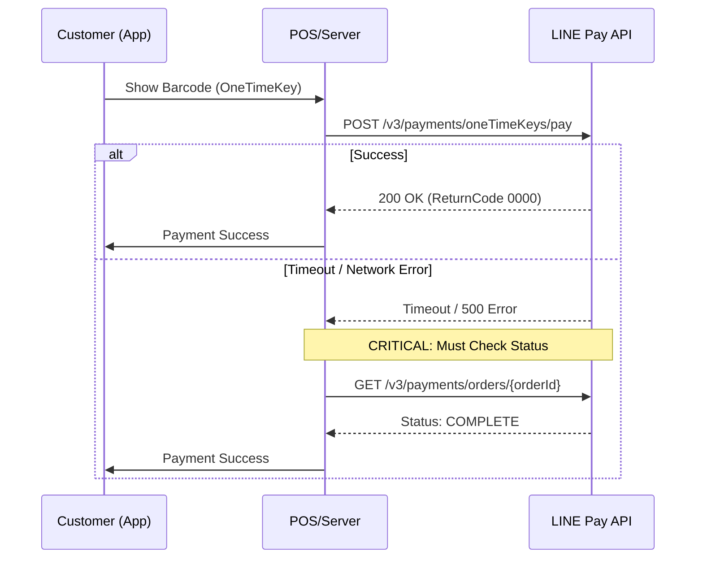

# LINE Pay Offline V4 PHP SDK

[](https://github.com/CarlLee1983/line-pay-offline-v4-php/actions/workflows/ci.yml)
[](https://packagist.org/packages/carllee/line-pay-offline-v4)
[](LICENSE)

現代化、類型安全的 LINE Pay Offline V4 API PHP SDK。

**🌐 Language / 語言 / 言語 / ภาษา:**
[English](./README.md) | [繁體中文](./README_ZH.md) | [日本語](./README_JA.md) | [ภาษาไทย](./README_TH.md)

## 功能特色

- ✅ **PHP 8.1+** 嚴格類型和枚舉
- ✅ **Laravel 整合** - ServiceProvider、Facade、IoC 支援
- ✅ **POS/Kiosk 終端支援** - 零售和餐飲服務
- ✅ **一次性金鑰付款** - 掃描客戶條碼
- ✅ **完整 API 支援** - 付款、請款、取消、退款
- ✅ **類型安全枚舉** - Currency、PaymentStatus 等
- ✅ **PHPStan Level Max** - 嚴格靜態分析
- ✅ **基於核心 SDK** - 與 Online SDK 共享程式碼

## 系統需求

- PHP 8.1 或更高版本
- Composer
- ext-json
- ext-openssl

## 安裝

```bash
composer require carllee/line-pay-offline-v4
```

## 支付流程



## 快速開始

> "✨ **開發者體驗:** 本 SDK 使用 DTOs 和 Enums。您的 IDE 將為請求參數和響應字段提供完整的自動完成，消除 'magic string' 的拼寫錯誤。"

```php
<?php

use LinePay\Offline\Config\LinePayOfflineConfig;
use LinePay\Offline\LinePayOfflineClient;
use LinePay\Offline\Enums\Currency;

// 建立設定
$config = new LinePayOfflineConfig(
    channelId: getenv('LINE_PAY_CHANNEL_ID'),
    channelSecret: getenv('LINE_PAY_CHANNEL_SECRET'),
    merchantDeviceProfileId: 'POS-001',  // 您的 POS 終端 ID
    merchantDeviceType: 'POS',           // 設備類型
    env: 'sandbox'                        // 或 'production'
);

// 建立客戶端
$client = new LinePayOfflineClient($config);

// 使用客戶條碼（oneTimeKey）請求付款
$response = $client->requestPayment([
    'amount' => 100,
    'currency' => 'TWD',
    'oneTimeKey' => '12345678901245678', // 來自客戶 LINE Pay 條碼
    'orderId' => 'ORDER-' . time(),
    'packages' => [
        [
            'id' => 'PKG-001',
            'amount' => 100,
            'products' => [
                ['name' => '咖啡', 'quantity' => 1, 'price' => 100]
            ]
        ]
    ]
]);

if ($response['returnCode'] === '0000') {
    echo "付款成功！\n";
    echo "交易 ID: " . $response['info']['transactionId'] . "\n";
}
```

## Laravel 整合

本套件支援 **Laravel Package Discovery**。只需透過 composer 安裝，ServiceProvider 和 Facade 將自動註冊。

### 設定

發布設定檔：

```bash
php artisan vendor:publish --tag=linepay-offline-config
```

在 `.env` 中加入：

```env
LINE_PAY_CHANNEL_ID=your-channel-id
LINE_PAY_CHANNEL_SECRET=your-channel-secret
LINE_PAY_MERCHANT_DEVICE_ID=POS-001
LINE_PAY_MERCHANT_DEVICE_TYPE=POS
LINE_PAY_ENV=sandbox
LINE_PAY_TIMEOUT=40
```

### 使用依賴注入

```php
namespace App\Http\Controllers;

use LinePay\Offline\LinePayOfflineClient;
use LinePay\Offline\Enums\Currency;

class POSController extends Controller
{
    public function __construct(
        private LinePayOfflineClient $linePay
    ) {}

    public function processPayment(string $oneTimeKey)
    {
        $response = $this->linePay->requestPayment([
            'amount' => 100,
            'currency' => 'TWD',
            'oneTimeKey' => $oneTimeKey,
            'orderId' => 'ORDER-' . time(),
            'packages' => [
                ['id' => 'PKG-001', 'amount' => 100, 'products' => [
                    ['name' => '咖啡', 'quantity' => 1, 'price' => 100]
                ]]
            ]
        ]);

        return response()->json($response);
    }
}
```

### 使用 Facade

```php
use LinePay\Offline\Laravel\LinePayOffline;

// 請求付款
$response = LinePayOffline::requestPayment($request);

// 檢查狀態
$status = LinePayOffline::checkPaymentStatus($orderId);

// 退款
$response = LinePayOffline::refundPayment($orderId, 50);
```

## API 方法

### 請求付款

使用客戶的一次性條碼請求付款：

```php
$response = $client->requestPayment([
    'amount' => 100,
    'currency' => 'TWD',
    'oneTimeKey' => '12345678901245678',
    'orderId' => 'ORDER-001',
    'options' => [
        'payment' => [
            'capture' => true  // 立即請款（預設）
        ],
        'extra' => [
            'branchId' => 'BRANCH-001',
            'branchName' => '總店'
        ]
    ]
]);
```

### 檢查付款狀態

檢查付款狀態（逾時後使用）：

```php
$status = $client->checkPaymentStatus('ORDER-001');
// 回傳: COMPLETE, FAIL, 或 REFUND
echo "狀態: " . $status['info']['status'];
```

### 請款

請款已授權的付款：

```php
$response = $client->capturePayment(
    orderId: 'ORDER-001',
    amount: 100,
    currency: Currency::TWD
);
```

### 取消授權

在請款前取消授權：

```php
$response = $client->voidAuthorization('ORDER-001');
```

### 退款

退款已完成的付款：

```php
// 全額退款
$response = $client->refundPayment('ORDER-001');

// 部分退款
$response = $client->refundPayment('ORDER-001', 50);
```

### 查詢授權

查詢授權資訊：

```php
$auths = $client->queryAuthorizations(orderId: 'ORDER-001');
// 或
$auths = $client->queryAuthorizations(transactionId: '1234567890123456789');
```

### 查詢付款詳情

獲取詳細付款資訊：

```php
$details = $client->retrievePaymentDetails(orderId: 'ORDER-001');
```

## 錯誤處理

```php
use LinePay\Core\Errors\LinePayError;
use LinePay\Core\Errors\LinePayTimeoutError;
use LinePay\Core\Errors\LinePayConfigError;

try {
    $response = $client->requestPayment($request);
    
} catch (LinePayTimeoutError $e) {
    // 發生逾時 - 務必檢查付款狀態
    $status = $client->checkPaymentStatus($orderId);
    
    if ($status['info']['status'] === 'COMPLETE') {
        // 儘管逾時，付款仍成功
        handleSuccessfulPayment($status);
    } else {
        // 付款失敗或仍在處理中
        handleFailedPayment($status);
    }
    
} catch (LinePayError $e) {
    // API 錯誤
    echo "錯誤代碼: " . $e->getReturnCode() . "\n";
    echo "錯誤訊息: " . $e->getReturnMessage() . "\n";
    
} catch (LinePayConfigError $e) {
    // 設定錯誤
    echo "設定錯誤: " . $e->getMessage() . "\n";
}
```

## 常見問題與疑難排解

### ⚠️ 重要：處理逾時（Read Timeout）

LINE Pay Offline API 涉及實際的網路延遲（連接 POS、等待用戶確認）。

**問題：**
如果回應時間超過您設定的逾時時間，您可能會收到 `ConnectTimeout` 或 `ReadTimeout`（cURL error 28）。

**解決方案：**
**絕對不要**僅因為逾時就假設付款失敗。交易可能已在 LINE Pay 伺服器上成功，只是您的伺服器放棄等待了。

1. **捕捉錯誤：** 務必捕捉 `LinePayTimeoutError`。
2. **二次確認：** 立即呼叫 `checkPaymentStatus($orderId)`。
3. **對帳：** 若 `checkPaymentStatus` 回傳 `COMPLETE`，將訂單視為已付款。

```php
try {
    $response = $client->requestPayment(...);
} catch (LinePayTimeoutError $e) {
    // 1. 記錄逾時
    // 2. 從 LINE Pay 檢查實際狀態
    $status = $client->checkPaymentStatus($orderId);
    
    if ($status['info']['status'] === 'COMPLETE') {
        // 視為成功處理
    }
}
```

### 🚫 OneTimeKey 重複使用（Error 1172）

客戶提供的 `oneTimeKey`（條碼）是**一次性的**，且很快就會過期（通常 5 分鐘）。

* **不要**在第一次請求因邏輯錯誤失敗後，嘗試重複使用條碼進行重試。
* **不要**使用硬編碼的條碼進行測試；您必須每次從 LINE App 重新產生。

### 💰 金額不符（Error 1106）

呼叫 `capturePayment()` 時，`amount` 必須與授權金額相符（除非您執行的是部分請款，如果允許的話）。

* 確保您的資料庫儲存了確切的授權金額。
* 可能會發生浮點數精度錯誤；考慮以整數（如分）儲存金額或使用 `bcmath`。

## 設定選項

| 選項 | 類型 | 必填 | 說明 |
|------|------|------|------|
| `channelId` | string | ✅ | LINE Pay Channel ID |
| `channelSecret` | string | ✅ | LINE Pay Channel Secret |
| `merchantDeviceProfileId` | string | ✅ | 您的 POS/終端設備 ID |
| `merchantDeviceType` | string | ❌ | 設備類型（預設："POS"）|
| `env` | string | ❌ | 環境："sandbox" 或 "production" |
| `timeout` | int | ❌ | 請求逾時秒數（預設：20）|

## 最佳實踐

### 1. 正確處理逾時

如 **[常見問題與疑難排解](#常見問題與疑難排解)** 段落所述，**絕不**將逾時視為失敗。務必使用 `checkPaymentStatus()` 驗證交易狀態。

### 2. 驗證付款金額

務必驗證回應中的付款金額：

```php
$response = $client->requestPayment($request);
$totalPaid = array_sum(array_column($response['info']['payInfo'], 'amount'));

if ($totalPaid !== $requestedAmount) {
    error_log("金額不符: 請求 $requestedAmount, 實付 $totalPaid");
}
```

### 3. 使用環境變數

切勿硬編碼憑證：

```php
$config = new LinePayOfflineConfig(
    channelId: getenv('LINE_PAY_CHANNEL_ID'),
    channelSecret: getenv('LINE_PAY_CHANNEL_SECRET'),
    merchantDeviceProfileId: getenv('MERCHANT_DEVICE_ID')
);
```

## 測試

```bash
# 執行測試
composer test

# 執行靜態分析
composer analyze

# 檢查程式碼風格
composer lint
```

## 相關套件

- [line-pay-core-v4](https://github.com/CarlLee1983/line-pay-core-v4-php) - 核心 SDK（依賴）
- [line-pay-online-v4](https://github.com/CarlLee1983/line-pay-online-v4-php) - 線上付款 SDK

## 授權

MIT 授權 - 詳見 [LICENSE](LICENSE)。

## 資源

- [LINE Pay Offline API 文件](https://pay.line.me/documents/offline.html)
- [LINE Pay 商家後台](https://pay.line.me/portal/tw/)
- [回報問題](https://github.com/CarlLee1983/line-pay-offline-v4-php/issues)
